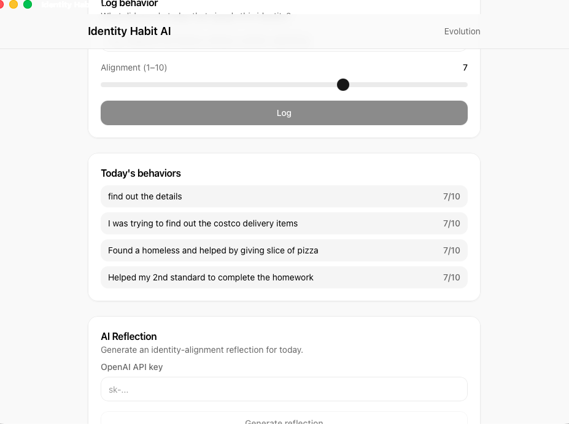
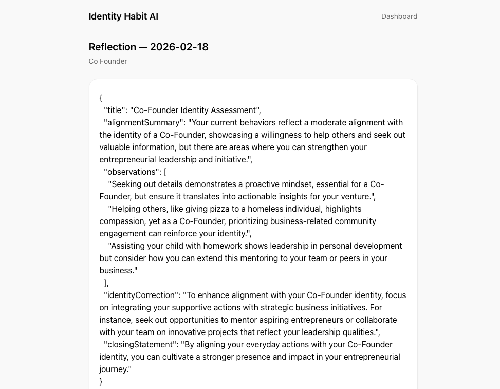
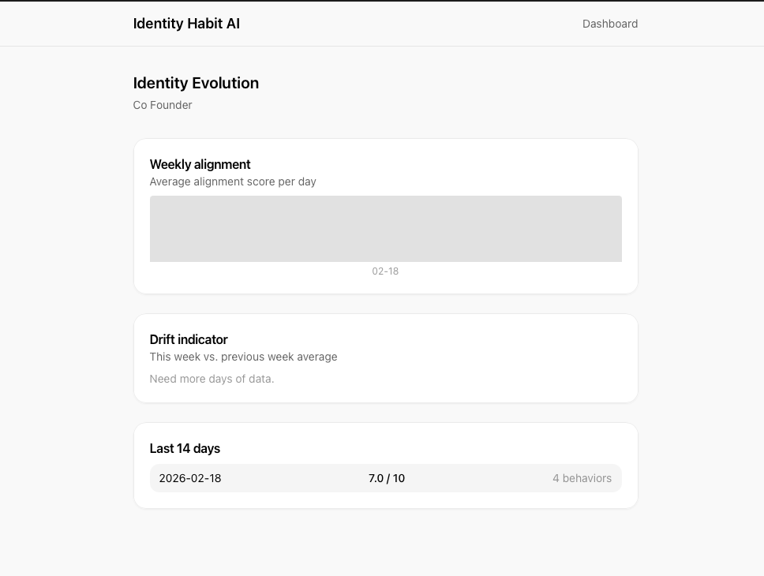

# 🧬 Identity Habit AI

**Track who you're becoming — not just what you do.**

A minimal macOS desktop app built on identity psychology: define an identity, log behaviors that signal it, score alignment, and get AI-powered reflections that reinforce who you are becoming.

---

## What it is

| | |
|---|---|
| **Not** a habit tracker | Tracks **identity alignment** and **drift** |
| **Local-first** | SQLite in the app; your data stays on your machine |
| **AI reflections** | Psychologically intelligent, non-generic coaching via OpenAI |
| **Apple-style UI** | Clean, minimal, high-performance |

**Flow:** Define identity → Add traits → Log daily behaviors with alignment (1–10) → Generate reflection → View evolution and drift over time.

---

## App overview

### Dashboard

The main screen for daily use. Use the header dropdown to pick which identity you’re tracking.

| Section | What it does |
|--------|----------------|
| **Log behavior** | Describe something you did (e.g. “Shipped the feature without context-switching”). Use the **Alignment (1–10)** slider to rate how well it matches your identity, then tap **Log**. |
| **Today’s behaviors** | List of everything you logged today with its alignment score (e.g. “7/10”). |
| **AI Reflection** | Enter your **OpenAI API key** (not stored), then tap **Generate reflection** to get an identity-alignment reflection for today. Use the **Evolution** link in the header to open the Evolution view. |



### Reflection

After you generate a reflection, the app shows a **Reflection** view for the selected date and identity (e.g. “Co Founder”). The AI returns a structured report with:

| Field | Description |
|-------|-------------|
| **title** | Short title for the assessment (e.g. “Co-Founder Identity Assessment”). |
| **alignmentSummary** | One-paragraph summary of how today’s behaviors align with your stated identity. |
| **observations** | Three concrete observations linking your actions to your identity. |
| **identityCorrection** | One suggestion to improve alignment (e.g. tying supportive actions to business initiatives). |
| **closingStatement** | A short closing line that reinforces identity without being generic. |

You can go back to **Dashboard** or **Regenerate** to create a new reflection for the same day.



### Identity Evolution

The **Evolution** page (linked from the Dashboard header) shows how your alignment changes over time for the current identity.

| Section | What it shows |
|--------|----------------|
| **Weekly alignment** | Average alignment score per day for the current week (chart). |
| **Drift indicator** | This week’s average vs. last week’s. “Need more days of data” appears until you have enough history. |
| **Last 14 days** | One row per day: date, average score (e.g. “7.0 / 10”), and number of behaviors logged. |

Use this view to spot identity drift and keep behaviors aligned with who you want to be.



---

## Tech stack

| Layer | Tech |
|-------|------|
| Desktop | [Tauri 2](https://tauri.app) (Rust) |
| Frontend | [Next.js 14](https://nextjs.org) (App Router), TypeScript, [TailwindCSS](https://tailwindcss.com) |
| Database | SQLite ([rusqlite](https://github.com/rusqlite/rusqlite)), local-first |
| AI | [OpenAI API](https://platform.openai.com) (reflections) |

---

## Quick start

### Prerequisites

- **Node.js** 18+
- **Rust** — [rustup](https://rustup.rs), then `rustup default stable`
- **macOS** — Xcode Command Line Tools: `xcode-select --install`

### Run in development

```bash
npm install
npm run tauri dev
```

This starts the Next.js dev server and opens the Tauri window. The app runs at `http://localhost:3000` inside the window.

### First-time setup: app icons

Tauri needs icons to build. Either:

- **Option A:** Add PNGs to `src-tauri/icons/`: `32x32.png`, `128x128.png`, `128x128@2x.png`, plus `icon.icns` and `icon.ico`
- **Option B:** Generate from one image: `npx tauri icon path/to/1024x1024.png`

### OpenAI API key

The app does not store your key. On the **Dashboard**, enter it in the “OpenAI API key” field before clicking **Generate reflection**. Optional later: store it in the system keychain via a Tauri plugin.

---

## Build for macOS

```bash
npm run build
CI=false npm run tauri build
```

**Output:** `src-tauri/target/release/bundle/macos/Identity Habit AI.app`  

Drag the `.app` into **Applications** or run it from the bundle folder.

---

## Project structure

```
Reflective/
├── app/                        # Next.js App Router
│   ├── layout.tsx              # Root layout + AppProvider
│   ├── page.tsx                # Home → redirect to onboarding or dashboard
│   ├── globals.css
│   ├── onboarding/             # Name → Identity → Traits
│   ├── dashboard/               # Log behaviors, alignment, generate reflection
│   ├── reflection/              # View or regenerate AI reflection
│   └── evolution/               # Weekly alignment chart, drift indicator
├── components/
│   └── ui/                      # Button, Card, Input, Slider, Textarea
├── lib/
│   ├── context.tsx              # App state (user, identities, currentIdentity)
│   ├── tauri.ts                 # Tauri invoke wrappers for all commands
│   └── types.ts                 # Shared TypeScript types
├── src-tauri/                   # Tauri (Rust) backend
│   ├── Cargo.toml
│   ├── tauri.conf.json          # Build + macOS bundle
│   ├── build.rs
│   └── src/
│       ├── main.rs, lib.rs
│       ├── db.rs                # SQLite path, init, schema
│       └── commands/            # Tauri commands
│           ├── user.rs
│           ├── identity.rs
│           ├── trait_.rs
│           ├── behavior.rs
│           ├── reflection.rs   # generate_reflection (OpenAI)
│           └── analytics.rs     # weekly alignment, trends
├── docs/
│   └── screenshots/             # App screenshots (dashboard, reflection, evolution)
├── package.json
├── next.config.mjs              # output: 'export' for Tauri
├── tailwind.config.js
└── README.md
```

---

## Database (SQLite)

All data is stored locally in a single SQLite file (WAL mode).

| Table | Purpose |
|-------|---------|
| `user` | id, name, created_at |
| `identity` | id, name, description, user_id, created_at |
| `trait` | id, name, identity_id, created_at |
| `behavior_log` | id, date, description, identity_id, alignment_score (1–10), created_at |
| `daily_reflection` | id, date, content, identity_id, created_at |

---

## AI reflection system

When you click **Generate reflection**, the app sends to OpenAI:

- Identity name and description  
- Traits  
- Today’s behaviors and alignment scores  

**System instruction:**  
*“You are a psychologically intelligent identity performance coach. Analyze behavioral alignment with the stated identity. Be specific, insightful, and constructive. Avoid generic motivation. Focus on identity reinforcement and misalignment patterns.”*

**Response format (JSON):** `title`, `alignmentSummary`, `observations` (3), `identityCorrection` (1), `closingStatement` (1). The raw content is stored and shown in the Reflection view; you can later parse the JSON in the UI for a richer layout.

---

## Extending the app

| Goal | Where to look |
|------|----------------|
| **New Tauri command** | Add `#[tauri::command]` in `src-tauri/src/commands/`, register in `lib.rs`, call from `lib/tauri.ts` via `invoke()`. |
| **New page** | Add `app/your-route/page.tsx` and link from the header or dashboard. |
| **New DB table** | Add `CREATE TABLE` in `db.rs` `init_db()`, then commands + frontend types. |
| **Weekly AI report / streaks** | Use `getAlignmentTrends` and `getWeeklyAlignment`; add a command that calls OpenAI with a weekly summary and surface it in Evolution or a new Reports page. |
| **Encrypted SQLite** | Use a Tauri plugin for encrypted SQLite or implement encryption in Rust. |

---

## License

Unlicensed unless you add one.
